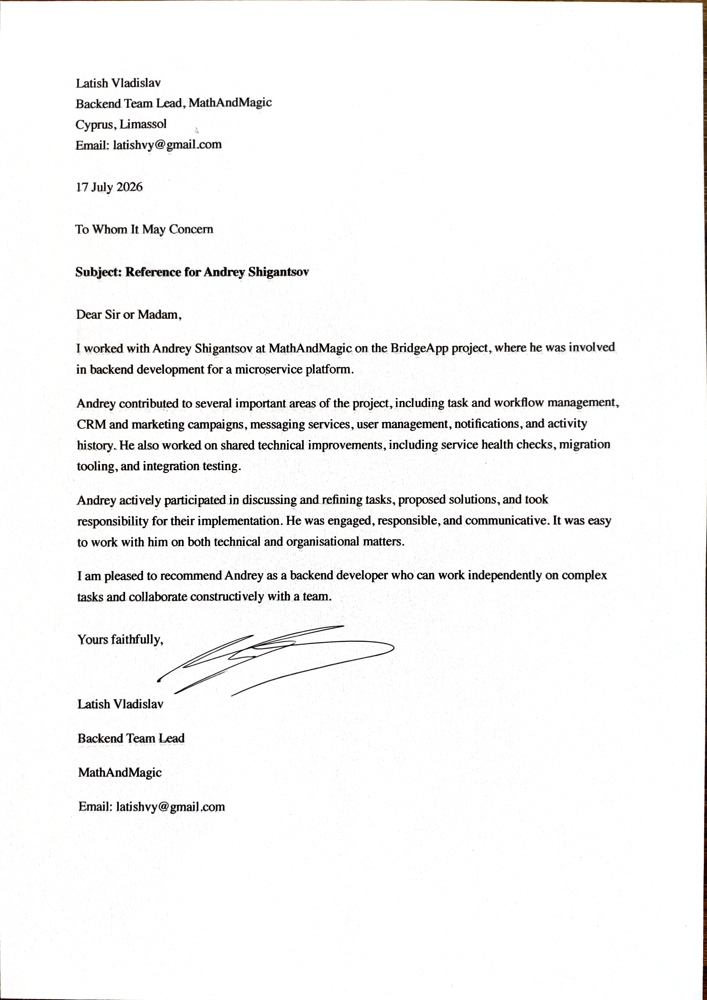

> NOTE: the latest version of this CV is available on GitHub: [github.com/andrey-shigantsov/CV](https://github.com/andrey-shigantsov/CV)

# Andrey Shigantsov
**Lead Backend Developer (Rust, AI-powered)**

a.shigantsov@gmail.com | Telegram: [@rasaro89](https://t.me/rasaro89) | GitHub: [github.com/andrey-shigantsov](https://github.com/andrey-shigantsov) | GitLab: [gitlab.com/andrey-shigantsov](https://gitlab.com/andrey-shigantsov) | Portfolio: [presentation](https://docs.google.com/presentation/d/1cu0rpvXFcqgHSNspt4M0GizctlspQlxM6nvBHP9CE2k/edit?usp=sharing)

---

## SUMMARY

Lead backend developer with **14+ years of experience**, specializing in **Rust** and **AI-assisted software development**, with a track record across high-load microservices, Solana smart contracts, and embedded C/C++ systems. Experienced in leading distributed Agile teams and shipping production backends built through AI-agent workflows — from planning to automated and manual review. Continuously refines agent rules and skills to minimize token consumption and reach required code quality in the fewest review iterations. Strong team player: responsible, hardworking, adaptable, and focused on continuous improvement of skills and working methods.

Desired role: Lead Rust Backend Developer, full-time, remote

---

## EXPERIENCE

### BridgeApp
**Rust Backend Developer** — Aug 2025 – Present
*Remote · Distributed team of Rust developers · Agile*

AI-powered collaboration platform. Backend development in Rust driven by AI agents.

- Developed Rust backend through AI-agent workflows (Opus 4.7, GPT 5.5, GLM 5.2; tokio, gRPC, Kafka/Redpanda, Redis, sqlx + PostgreSQL, and more).
- Built and maintained an integration testing system for gRPC services using sqlx-based tests in Rust.
- Refined a multi-stage AI development loop: detailed planning with an agent → agent implements → several review iterations by a second agent → thorough manual review → agent applies fixes.
- Authored and continuously improved agent rules and skills to minimize token consumption and reduce review iterations to reach target code quality, including tech-documentation rules that serve as the agent's persistent memory.
- AI tooling: Cursor; VS Code + magic-coder (TUI AI editor similar to Claude Code / OpenCode); [superpowers](https://github.com/obra/superpowers) and [andrej-karpathy-skills](https://github.com/multica-ai/andrej-karpathy-skills) plugins.
- **Open source:** [github.com/MathAndMagic/bql](https://github.com/MathAndMagic/bql) — specification of a JQL-like query language with libraries for Rust, TypeScript, Swift, and Kotlin auto-generated from the spec.

### STREAM TECH LLC (ООО «СТРИМ ТЕХ»)
**Rust Backend & Solana Developer** — Nov 2022 – Aug 2025 (2 years 9 months)
*Remote · Distributed team of Rust developers · Agile*

Backend services and on-chain programs for blockchain products.

- Developed Rust backends (tokio, PostgreSQL, Solana, and more).
- Developed and maintained smart contracts for the Solana blockchain.
- **Open source (texture.fi):**
  - [price-proxy](https://github.com/texture-fi/price-proxy) — Solana contract providing unified access to fresh prices from multiple arbiters; developed the system core and the testing system.
  - [common/macros](https://github.com/texture-fi/common/tree/master/macros) — shared macros used across all contracts, programs, and services.
  - [anchor-interface](https://github.com/texture-fi/anchor-interface) — lightweight library for interacting with `anchor-lang` smart contracts.

### TRADETECH DEVELOPMENT LLC (ООО «Трейдтех Девелопмент»)
**Rust Backend & Solana Developer** — Apr 2021 – Nov 2022 (1 year 8 months)
*Fully remote · Distributed team of Rust developers · Agile*

High-load microservices and Solana DeFi infrastructure. Held partial project-lead responsibilities alongside development.

- **Project-lead duties:** team coordination, task tracking in Jira, planning and organizing work, daily progress monitoring, reporting on results.
- Built high-load microservices on async-I/O Rust (tokio, serde, prost, ClickHouse, and more).
- Developed smart contracts for the Solana blockchain.
- **Key achievement — DEX-connector smart contract** (Leveraged Staking project for texture.finance): a Solana contract for unified token exchange across multiple decentralized exchanges. At the time of writing it supported Orca / Whirlpools; the contract executes large-volume swaps distributed over time in small portions to minimize market impact.
- **Technologies learned on the job:**
  - **Solana:** smart-contract development, automated testing (`solana-program-test`, `solana-test-validator`), interaction via the Rust client.
  - **ClickHouse:** schema creation and maintenance, migrations for `golang-migrate`, interaction via the Rust client.
  - **Grafana + Prometheus:** emitting metrics from Rust services and building advanced dashboards.
  - **Apache Kafka:** consuming data via the Rust client.
  - **Docker.**

### KV-SVYAZ (НПООО «КВ-связь»)
**C/C++ Programmer** — Mar 2017 – Sep 2019 (2 years 7 months)
*Software Development Project Lead / Scrum Master* — Mar 2019 – Aug 2019 (6 months)

Embedded and application software for communication systems.

- Developed embedded software in C (HOST, DSP) on Cortex-Mx and TMS320C674x cores.
- Developed application software in C++ with Qt.
- Authored technical documentation and typeset documents in LaTeX.
- **As Project Lead / Scrum Master:** strategic and operational planning, delivery to the customer, and oversight of the development process.

### Freelance
**C/C++ Programmer** — Apr 2015 – Apr 2016 (1 year 1 month)

### ONIIP
**Software Engineer (2nd category)** — Feb 2010 – Mar 2015 (5 years 2 months) · Omsk

---

## EDUCATION

**Specialist Degree, Information Security (Comprehensive Information Security of Automated Systems)**
Siberian State Automobile and Highway Academy (СибАДИ) — 2006 – 2011

---

## SKILLS

- **Methodologies:** Agile, Agile/Scrum
- **Languages:** Rust, C, Qt/C++
- **Backend:** tokio, gRPC, REST, serde, prost, async-I/O
- **Data & Messaging:** PostgreSQL (sqlx), ClickHouse, Redis, Apache Kafka / Redpanda
- **Blockchain / Solana:** smart contracts, `anchor-lang`, DEX integrations, `solana-program-test`, `solana-test-validator`
- **Observability:** Prometheus, Grafana
- **Tooling & DevOps:** Docker, Git, GitLab, Jira, CI/CD
- **Documentation:** Markdown, LaTeX
- **AI-Assisted Development:** AI-agent workflows (planning → implementation → review loop), agent rules & skills engineering, tech docs as persistent agent memory
- **Spoken languages:** Russian (Native), English (A2 – Pre-Intermediate)

---

## RECOMENDATIONS

